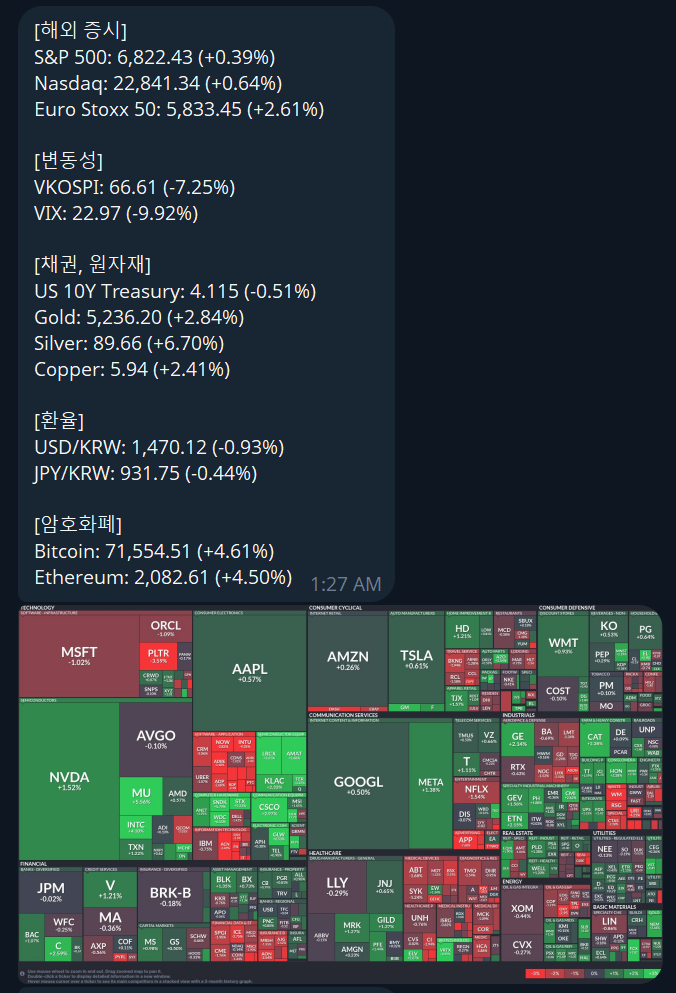
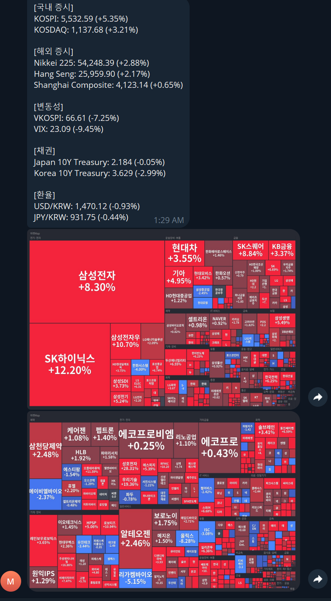

**Language:** **한국어** | [English](docs/README.en.md)

# Macro Pulse Bot

매일 미국장/한국장 마감 후 주요 매크로 지표를 수집하고, 시황 이미지와 함께 텔레그램 채널에 자동으로 발송하는 봇입니다.

## 주요 기능

| 모드 | 실행 시각 (KST) | 내용 |
|------|----------------|------|
| `US` | 화~토 오전 6:30 | 미국장 마감 후: S&P500/Nasdaq/VIX/채권/환율 + @yakjangsu 이미지 5장 |
| `KR` | 월~금 오후 5:00 | 한국장 마감 후: KOSPI/KOSDAQ/VIX/환율 + KOSPI/KOSDAQ 히트맵 |

### 이미지 소스 (US 모드)

US 마감 보고서에서 이미지는 `@yakjangsu` 텔레그램 채널에서 가져옵니다. 이 채널은 미국장 마감 직후(인도시간 기준 오전 2시, KST 오전 5시경) 시황 차트를 자동으로 포스팅합니다. Telethon MTProto 클라이언트로 해당 배치에서 이미지 5장을 선택합니다.

> 이전 버전에서는 Selenium으로 FinViz 맵을 직접 캡처했으나, 안정성·속도·토큰 절약을 위해 yakjangsu 채널 방식으로 전환했습니다.

## 동작 파이프라인

```
[GitHub Actions cron]
    │
    ├─ Yahoo Finance / CNBC  ──→ 지표 수집 (market_data.py)
    │
    ├─ US 모드: @yakjangsu Telethon  ──→ 이미지 5장 다운로드
    │   KR 모드: Selenium (hankyung.com) ──→ KOSPI/KOSDAQ 히트맵
    │
    ├─ HTML 리포트 생성 + GitHub Pages 배포
    │
    └─ Telegram Bot API  ──→ 요약 텍스트 + 이미지 전송
```

자세한 구조는 [`docs/ARCHITECTURE.md`](docs/ARCHITECTURE.md)를 참고하세요.

## 수집 항목

- 국내 지수: `KOSPI`, `KOSDAQ`
- 해외 지수: `S&P 500`, `Nasdaq`, `Nikkei 225` 등
- 금리/원자재: `US 10Y Treasury`, `Gold`, `Silver`, `Copper`
- 환율: `USD/KRW`, `JPY/KRW`, `EUR/KRW`, `CNY/KRW`
- 가상자산: `Bitcoin`, `Ethereum`
- 변동성: `VIX`, `VKOSPI`

## GitHub Actions

이 저장소는 GitHub Actions를 사용합니다.

- 정해진 시간에 자동으로 리포트를 만듭니다.
- 최신 리포트를 GitHub Pages에 올릴 수 있습니다.
- 실행 로그와 결과 파일을 artifact로 저장합니다.
- 실패하면 Telegram으로 알림을 보내도록 설정할 수 있습니다.

TELEGRAM Token등 KEY 설정은 [`docs/SECRETS.md`](docs/SECRETS.md)에서 볼 수 있습니다.

## 포맷 설정

텔레그램 요약 순서, 스크린샷 종류, KR/US 스케줄은 [`config/report_formats.json`](config/report_formats.json)에서 바꿀 수 있습니다.

- 어떤 섹션을 먼저 보여줄지
- 어떤 항목을 포함할지
- 어떤 스크린샷을 붙일지
- KR/US 리포트가 실행될 cron 시간

코드를 몰라도 JSON만 조금 수정하면 순서를 바꿀 수 있습니다.

## 초기 설정

### 1. Telegram 시크릿 등록 (GitHub Actions Secrets)

`Settings > Secrets and variables > Actions`에서 아래 항목을 등록합니다.

| Secret 이름 | 설명 |
|-------------|------|
| `TELEGRAM_BOT_TOKEN` | @BotFather에서 발급한 봇 토큰 |
| `TELEGRAM_CHAT_ID` | 리포트를 보낼 채널/그룹 ID |
| `TELEGRAM_API_ID` | [my.telegram.org](https://my.telegram.org) App API ID |
| `TELEGRAM_API_HASH` | my.telegram.org App API Hash |
| `TELEGRAM_SESSION_STRING` | Telethon StringSession (`scripts/generate_session.py`로 생성) |

### 2. Telethon 세션 생성 (최초 1회)

```bash
uv run python scripts/generate_session.py
```

출력된 `TELEGRAM_SESSION_STRING` 값을 `.env` 파일과 GitHub Secrets에 저장합니다. 이후에는 재인증 없이 GCP/Docker 환경에서 자동 실행됩니다.

### 3. GitHub Pages (선택)

`Settings > Pages > Source`를 `GitHub Actions`로 설정하면 매일 최신 HTML 리포트가 자동 배포됩니다.

## 로컬 / Docker 실행

자세한 실행 방법은 [`docs/LOCAL_RUN.md`](docs/LOCAL_RUN.md)에서 볼 수 있습니다.

> 빠른 미리보기
>
> - 설치: `uv sync --all-groups`
> - Python dry-run: `uv run python src/main.py --dry-run`
> - Docker build: `docker build -t macro-pulse .`
> - Docker dry-run: `docker run --rm --env-file .env -v "$PWD:/app" -w /app macro-pulse uv run --frozen python src/main.py --dry-run`

## 테스트

기본 테스트:

```bash
uv run python -m unittest discover tests
```

실제 외부 서비스까지 확인하는 스모크 테스트:

```bash
RUN_LIVE_SMOKE_TESTS=1 uv run python -m unittest discover tests
```

스크린샷 스모크 테스트:

```bash
RUN_SCREENSHOT_SMOKE_TESTS=1 uv run python -m unittest tests.test_screenshot
```

## 스크린샷 예시

### 미장 마감 예시



### 국장 마감 예시



## 자주 보는 파일

- [`src/main.py`](src/main.py): 전체 실행 시작점
- [`src/macro_pulse/data/market_data.py`](src/macro_pulse/data/market_data.py): 데이터 수집 orchestration
- [`src/macro_pulse/reporting/generator.py`](src/macro_pulse/reporting/generator.py): 리포트 생성
- [`src/macro_pulse/delivery/notifier.py`](src/macro_pulse/delivery/notifier.py): 텔레그램 전송
- [`config/report_formats.json`](config/report_formats.json): 요약 포맷 설정

## 문제 해결

- 스크린샷이 실패하면 Chrome/Chromium 실행 환경을 먼저 확인하세요.
- 텔레그램 메시지가 안 오면 `TELEGRAM_BOT_TOKEN`, `TELEGRAM_CHAT_ID`를 확인하세요.
- 일부 데이터가 비어 있으면 외부 사이트 응답 문제일 수 있습니다.
- GitHub Pages가 안 보이면 `Settings > Pages`에서 source가 `GitHub Actions`로 설정되어 있는지 확인하세요.
